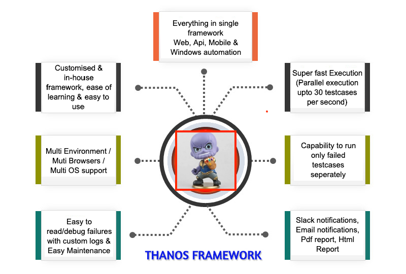
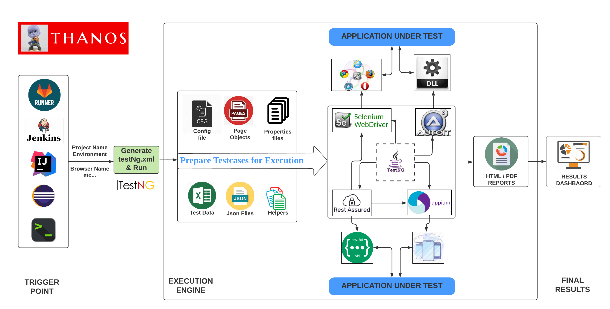

# Thanos - Test Automation Framework

Thanos Framework is a single framework to perform all the automation tasks for frontend and backend services. This is Hybrid Framework created using properties of `Page Object Model` and `Data Driven` automation frameworks.
It is created using the latest Selenium features with Java, TestNG and Maven for Web-based automation, integrated with Appium for Mobile App automation and Rest Assured for API Automation execution.

This is the list of tools, being used in this framework:

1. Apache Maven
2. Java 17
3. Selenium Webdriver
4. Selenium Grid
5. TestNG Framework
6. Rest Assured Framework
7. Appium Server
8. Jenkins
9. Chrome Web & Mobile View
10. Firefox Web & Mobile View
11. Email Notifications
12. Slack Notifications

# What is Test Automation Framework?

A “Test Automation Framework” is scaffolding that is laid to provide an execution environment for the automation test scripts. The framework provides the user with various benefits that help them to develop, execute and report the automation test scripts efficiently. It is more like a system that has created specifically to automate our tests.

In a very simple language, we can say that a framework is a constructive blend of various guidelines, coding standards, concepts, processes, practices, project hierarchies, modularity, reporting mechanism, test data injections etc. to pillar automation testing. Thus, the user can follow these guidelines while automating application to take advantages of various productive results.

The advantages can be in different forms like the ease of scripting, scalability, modularity, understandability, process definition, re-usability, cost, maintenance etc. Thus, to be able to grab these benefits, developers are advised to use one or more of the Test Automation Framework.

# What is the Page Object Model?

The Page Object Model is a design pattern of testing, derived from the Object Oriented Programming concepts. The POM describes the web application into the number of web pages being used and contains the elements as properties and actions as methods. This offers you low maintenance on the tests developed.


# Main Capabilities of Thanos



1. Supports execution on Web Automation on `Multiple Browsers` both on Web view and Mobile View using Selenium Grid
2. Supports execution of `API Automation` using Rest assured framework
3. `Mobile automation` using Appium integrated within the same framework
4. `Windows Desktop App Automation` can be done using AutoIt
5. Configurable Email and `Slack notifications` after every execution
6. Option to use `Offline Reports` (as PDF attachments) and/or `Online Reports` (as a web server) available
7. Test cases can be picked/executed based of certain `groups/tags` like 'regression', 'apiCases', 'uiCases', 'production'
8. Supports Execution via `Gitlab Runner` as well as via `Jenkins`
9. Multiple `Windows+Linux+Mac machines` being used to run daily automation
10. Automation can be executed on `multiple environments` like Staging, Sandbox, Production, Canary etc
11. Proper `Logs and Screenshots` are attached to every test case
12. Capability to `only execute failed test cases` from the last run

# Steps for Local Execution

1. Import this project in Eclipse/IntelliJ as “Existing Maven Project”
2. Install the TestNG plugin in Eclipse
3. Go to `TestLoginFlows.java` and run the first testcase present in src/test/java/Automation/CustomerPortal/TestLoginFlows.java
4. Chrome browser will launch and perform the successful login flow on Customer Frontend
5. Once finished, output can be seen out in `index.html` file present in the `test-output` folder, or directly in the Eclipse/IntelliJ console.

# Steps For Remote Execution

Different Parameters Needed:

1. `PROJECT_NAME="CustomerFrontend"`    #Pass project name for which you want to execute automation. Like : Access,Payment,SaaS,CustomerFrontend
2. `ENVIRONMENT="Staging"`  #Select Environment on which you want to execute automation. All options : Staging, Sandbox, Production
3. `BROWSER="Chrome"`   #Select Browser on which you want to execute automation. All options : Chrome, Firefox, Api, Mobile
4. `SEND_EMAIL_TO="mukesh.r@example.com"`    #Email/s on which you want to send the execution report. Format : mukesh.r@example.com
5. `BUILD_TAG="Counter123"`     #Any randomString/Number used as Build Id, but it should be unique every time
6. `GROUP_NAME="apiCases"`  #Select all Groups/Tags of testcases which you want to execute. All options : P0, P1, apiCases, uiCases, regression, production
7. `SEND_REPORT_ON_SLACK="true"`    #Pass true, if you want to send execution report to slack channel
8. `MOBILE_VIEW_EXECUTION="false"`  #Pass true, if you want to execute automation on mobile view
9. `BRANCH_NAME="master"`   #Mention branch name of "thanos" project if you want to execute automation on that branch, default is master(only applicable for Jenkins)
10. `DEBUG_MODE="false"`    #Pass true, if you want to extra logs in automation report to debug easily
11. `RERUN_LAST_FAILURES="false"`    #Pass true, if you want to rerun only failed testcases from the last execution
12. `LOCALE="ID"`    #Pass country code / locale value if you want to execute automation for different locale, default value is ID. All options : ID, SG, TH
13. `APP_LANGUAGE="EN"`    #Pass App language value if you want to execute automation for different languages, default value is EN. All options : EN, ID, VI

Commands:

1. Build the project

```shell
mvn clean install -DskipTests
```

2. Run the test

```shell
cd $WORKSPACE & mvn exec:java -Dexec.mainClass=Automation.Utils.GenerateTestngXmlAndRun -Dexec.args="CustomerFrontend Staging Chrome mukesh.r@example.com Jenkins-123456 regression true false main false false SG EN" -Dexec.classpathScope=test
```

# Architecture



# How to Videos

##### [Write your first 'Web' Automation testcase](https://www.screencast.com/t/X5FFwGtfa)

##### [Write your first 'Api' Automation testcase](https://www.screencast.com/t/iyAysXwk5Q)
